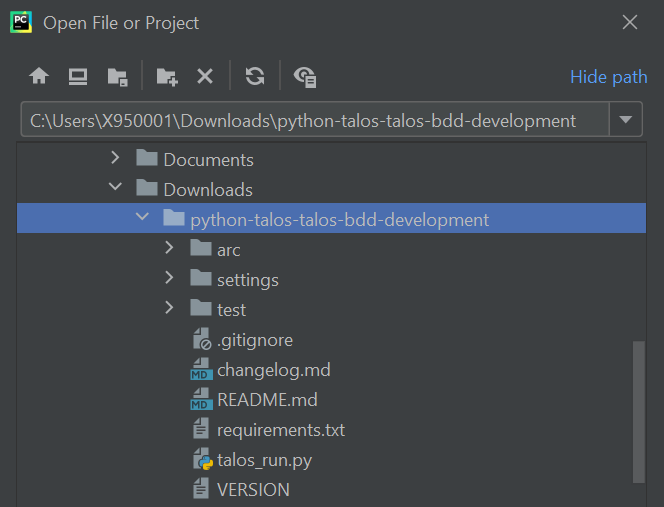
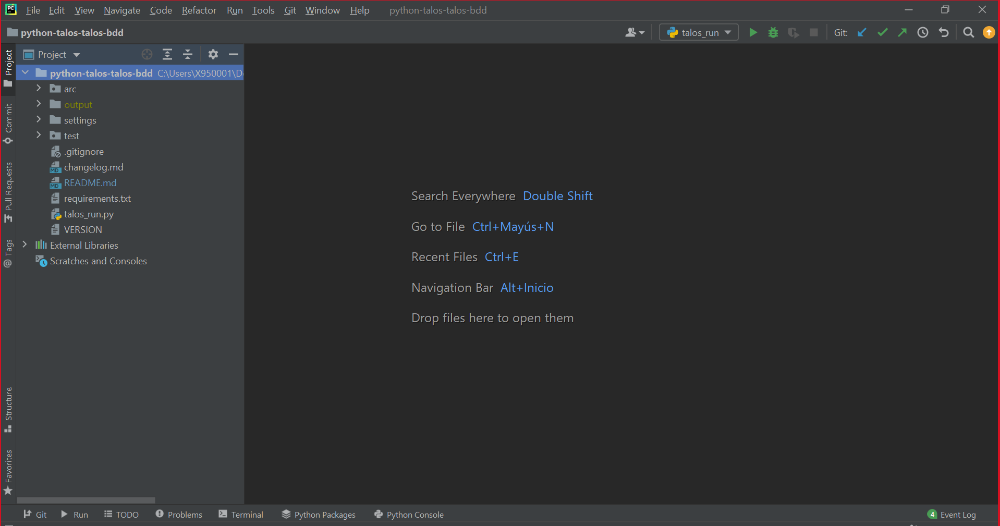
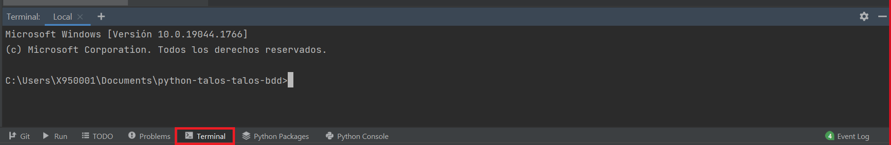
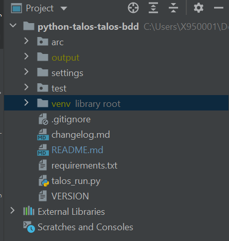
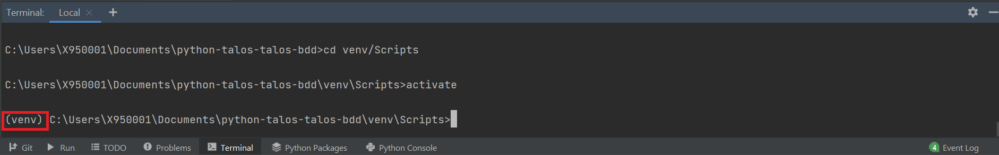
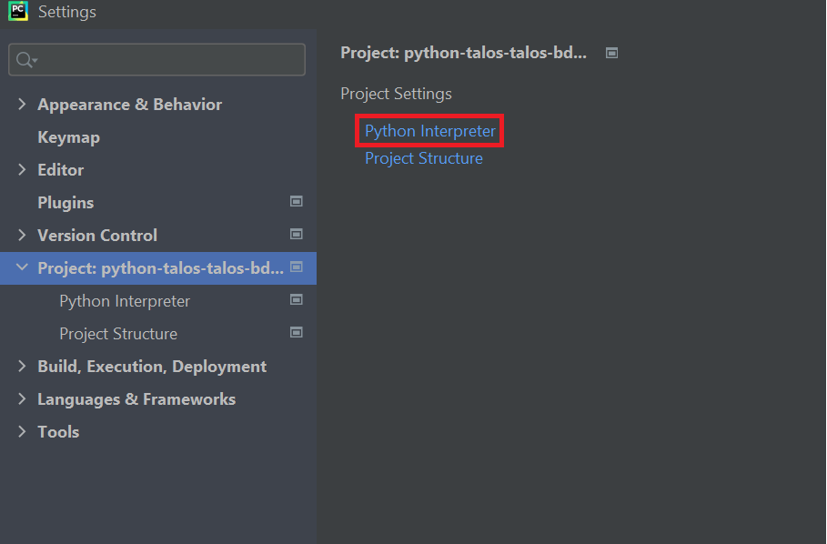
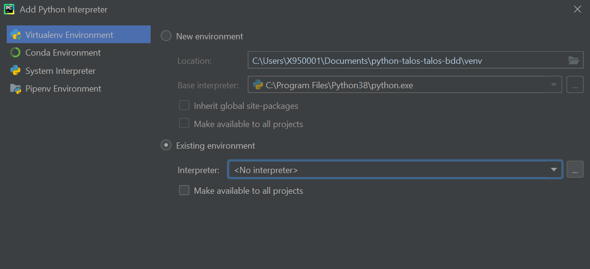
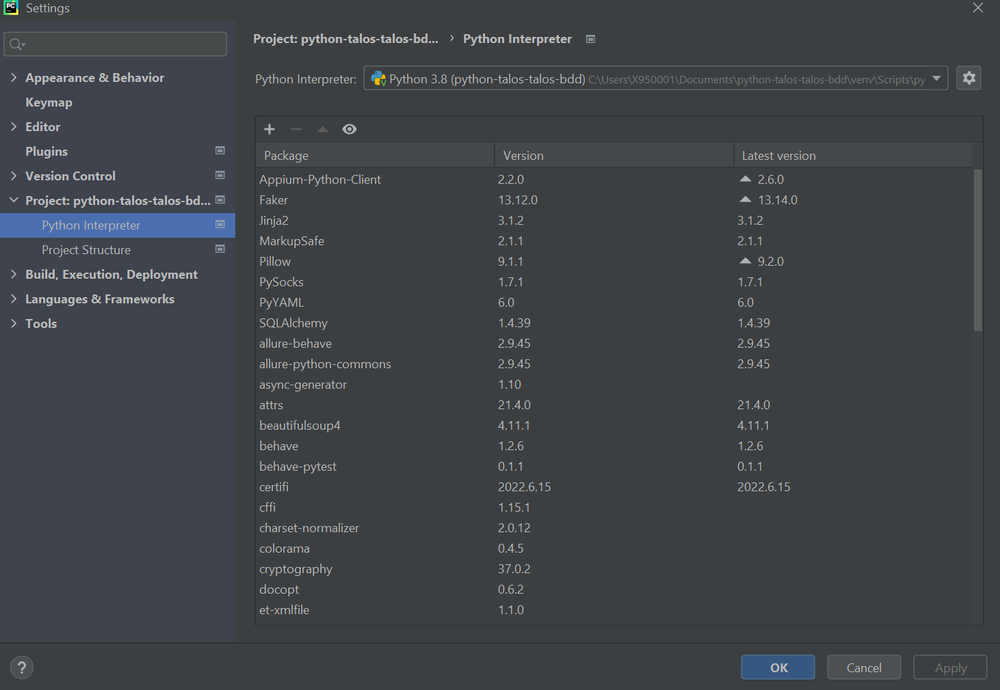
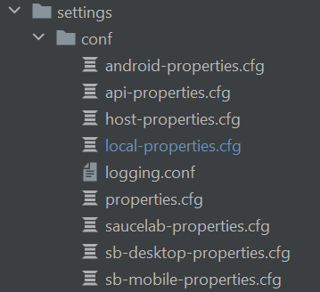

#  TALOS BDD Automation Framework

> A framework developed and supported by the ***Testing Automation CoE - Automation Toolkit***

**TALOSBDD** is a [Python](https://devdocs.io/python~3.6/) test automation framework based on the BDD development
methodology. Uses a Gherkin language layer for automated test case development. It allows the automation of functional
tests web, mobile, API, FTP, among others, in a simple, fast and easy maintenance way.

**You can find more information and documentation in the Confluence space of the [Automation Toolkit](https://confluence.alm.europe.cloudcenter.corp/display/QUASER/TALOS+BDD)**

----

## Table of Contents  
1. [About TALOSBDD](#about-talosbdd)  
2. [Requirements](#requirements)  
3. [How to download TALOS BDD](#how-to-download-talos-bdd)  
   - [Download mode](#download-mode) 
4. [How to install](#how-to-install)
5. [Folder structure](#folder-structure)  
6. [TALOSBDD settings](#talosbdd-settings)
   - [TALOSBDD config](#talosbdd-config)
   - [Run configuration](#run-configuration)
7. [How to run the framework](#how-to-run-the-framework)
   - [Through the IDE](#through-the-ide)
   - [By Command Line](#by-command-line)
    
----

## About TALOSBDD
TALOS BDD is based on open technologies to offer the necessary functionalities to automate your tests. Among these
technologies are:

- [Behave](https://behave.readthedocs.io/en/latest/)
- [Selenium](https://www.seleniumhq.org/docs/)
- [Appium](http://appium.io/docs/en/about-appium/intro/)
- [Request](https://requests.readthedocs.io/en/master/)
- [Records](https://pypi.org/project/records/)
- [Pillow](https://pillow.readthedocs.io/en/stable/)
- [Pytest](https://docs.pytest.org/en/stable/contents.html)

**TALOSBDD** is an all-terrain Framework:

- **Multi-platform**
    - Allows execution in Windows, Linux and Mac environments
- **Multi-functional**
    - It allows automating functional tests Web, Mobile, microservices, FTP, Database, etc.
- **Multi-device**
    - Allows execution in all browsers, headless, Android and iOS mobile devices, virtualization, local devices and in
      the cloud
- **Multi-environments**
    - Allows easy data management between business environments

----

## Requirements

- [Python 3.7+ 64 bits](https://www.python.org/downloads/release/python-370/)
- [PyCharm](https://www.jetbrains.com/es-es/pycharm/) as a highly recommended IDE

----

## How to download TALOS BDD

**TALOSBDD** is managed by the Automation Toolkit team, so its use is upon request to the CoE Automation Testing.


### Download mode

1. Go to TALOSBDD Github repository and do a clone or download of the repository.
    -   https://github.alm.europe.cloudcenter.corp/sgt-talos/python-talos-talos-bdd
2. Request access to the **TALOS Automation Framework Teams** group and in the "Files" tab in the "TALOS BDD" folder you
   can download a compressed file with the Framework binaries.
3. Contact the **CoE Automation Testing**, and you will be given a copy of the compressed file with the Framework.

----

## How to install

The installation of **TALOSBDD** is very simple, just open the project in your IDE and configure the virtual
environment that the framework brings with it. For this the following will be done:

> The following step guide will be done keeping in mind that you have selected PyCharm as your IDE. For the rest of the IDE, please find in its documentation how to configure the Python virtual environment.

1. #### Open PyCharm
2. #### In File \> Open... look for the path where I unzip the framework .zip
3. #### Make sure that in the previous step you have chosen as the parent folder the folder containing the framework files and folders.



4. #### Make sure you can see the following filesystem in the IDE



5. #### Wait for the IDE to index the project. At the bottom right of the framework a loading bar will appear indicating the indexing progress
   > Normally Pycharm automatically detects the virtual environment and identifies that the framework interpreter is in the "env" folder. If this does not happen, follow the next steps
6. #### Set up the virtual environment
   - Click on Terminal
     
   - Create a new venv typing:
    ```bash
    $ python -m venv venv
    ``` 
   - After the above step, the venv folder has been created in the project path
     
   - Type in terminal (required to activate the virtual environment):
    ```bash
    $ venv\Scripts\activate
    ``` 
   - Shall appear (venv) if is correctly activated
     
   - install now the requirements.txt typing:
     ```bash
     $ pip install -r requirements.txt
     ``` 
     > If you have any problems installing the dependency try configuring pip to connect to the nexus or run pip install through a proxy.
   - Go to File > Settings ...
   - Among the options on the right you will find the option "Project: [folder_name]", select this option
   - Select the "Python Interpreter" option
     
   - Select the nut to the right of the "Python Interpreter" field
   - Select the option "Add ..."
   - Make sure the "Virtualenv Environment" option on the left is selected and select the "Existing environment" radius
     button
   - Click on the button with the ellipsis (...) to the right of the "Interpreter" field
     
   - A file explorer will open, you must go to the project path and then go to venv \> Scripts and look for the
     Python.exe file, select it and click the OK button
   - Make sure that the "Interpreter" field shows the path of the Python.exe file that you just selected in the
     previous step
   - Press the OK button and if everything has gone well, the list of packages used by the framework will appear as it
     appears in the following image
     
   - Press the OK button again and let the IDE index all packages
   - If everything went well, the text "library root" will appear on the left of the "venv" folder in the IDE

----

## Folder structure

Within the **TALOSBDD** Framework you will find the following folders

- **arc -->** There are all the files related to the functionalities of the Framework. It is recommended **not to change** the content of this folder for a good functioning of the Framework and an easy version migration. All the changes you make in this folder **will be erased** in subsequent updates.
- **venv -->** In this folder are the virtual environment configuration and all the packages that the framework uses for its operation. **No file in this folder should be changed.**
- **test --> Folder that contains everything related to the creation of the automation** 
  - **helpers -->** The "pageobject" and "apiobject" folders will be stored in this folder, its function is to house all the files that the developer needs to carry out his tests, in addition to the extra functionalities that he has to develop to carry out the particularities of his project.
    -  **pageobject -->** Folder that stores the .py files related to the page objects of the automation of functional interface tests.
    -  **apiobject -->** Folder stores all the .py files and other types of files that are needed to carry out the automation of microservices.
  - **features -->** In this folder all files with extension **.feature** will be stored.
  - **steps -->** folder that will contain all the files related to the Gherkin steps, in these .py format files you will find the declarations of the Gherkin verbs with their automation code.
- **settings -->** folder that has everything related to the **framework configuration**.
   - **conf -->** folder that contains all the execution type configuration properties files.
   - **profiles -->** folder containing the folders that simulate the runtime environments with their respective JSON and YAML files for test data management.
   - **drivers -->** folder containing the drivers of the different browsers
- **output -->** destination folder of the reports and files generated by the framework.

----

## TALOSBDD settings

### TALOSBDD config

All **TALOSBDD** configuration is centralized in the **talosbdd.cfg** file in the "input" folder.


~~~
[TALOSBDD]
deleteOldReports = true                # option to remove all reports from the "output" folder before execution
close_driver = true                    # option to choose whether to close the browser after execution
continue_after_failed_step = false     # option to allow execution to continue after a step fails


[REPORTS]
posttoALM = false                      # publish in MF ALM the evidence of the executed cases. (It is mandatory to also have the "generateJSON" option set to true)
match_ALM_execution = false            # option to overwrite MF ALM test sets
ALM3_properties = false                # option to generate the alm.properties file for uploading evidence in MF ALM 3
generateJSON = true                    # generation of JSON files for evidence in MF ALM (mandatory to have this option set to true if you want to upload the evidence to MF ALM)
generateHTML = true                    # option to generate a report HTML for each feature executed
generateScreenshot = false             # option to allow an automatic step capture
generateDOCX = false                   # option to generate a word document evidencing the executed cases
generateTXT = true                     # option to generate a TXT file with the execution summary


[PROFILES]
environment = cer                      # select which profile folder to select as the runtime environment
master_file = master                   # select the default data collection file for use as in Templeate Var
locale_fake_data = es_ES               # select the language and country of the data generated with the Faker package


[CATALOG]
excel_file_name = catalogo             # select the name of the excel file from the steps catalog
update_step_catalog = true             # generate / update excel from step catalog


[CATALOG.SHEET]
user_steps = false                     # option to add the steps developed by the user to the step catalog
default_api = false                    # option to add the default API steps in the step catalog
default_funcional = false              # option to add the default Functional steps in the step catalog
default_datas = false                  # option to add the default Datas steps in the step catalog
default_ftp = false                    # option to add the default FTP steps in the step catalog
default_web = false                    # option to add the default Web steps in the step catalog


[JIRA]
posttoJira = true                                     # enables the upload of evidence to JIRA
username = user_name                                  # JIRA Username
password = user_pass                                  # JIRA Password
base_url = https://jira.alm.europe.cloudcenter.corp   # JIRA Server url
comment_execution = true                              # upload an execution summary comment to the JIRA ISSUE
comment_scenarios = true                              # upload a comment summarizing the execution of each sccenario in the JIRA ISSUE
upload_doc_evidence = true                            # Upload the word document of evidence of the scenarios as an attachment to a JIRA ISSUE
upload_txt_evidence = true                            # Upload the TXT summary execution as an attachment to a JIRA ISSUE
upload_html_evidence = true                           # Upload the HTML summary feature execution as an attachment to a JIRA ISSUE
~~~

### Run configuration

The webdriver configurations can be found in the path: settings \> conf.
Inside this folder you will find files with cfg formats that represent different types or modes of execution.



The mode of use is very simple, you can create as many cfg configuration files as you want, taking into account the mandatory naming of the file name:

`[config_name]-properties.cfg`

Where "config_name" is the variable name that you want to name the configuration file, and the rest are mandatory.

Within each configuration file of the execution we will see the following:

~~~
[Test]
url:

[Driver]
# Valid driver types: firefox, chrome, iexplore, edge, safari, opera, phantomjs, ios, android, api (no driver)
# edgeie (edge with ie compatibilities), host
type: edgeie
# Configure local driver paths
gecko_driver_path: geckodriver.exe
# linux
;chrome_driver_path: chromedriver
# windows
;chrome_driver_path: chromedriver.exe
chrome_driver_path: chromedriver101.exe
explorer_driver_path: IEDriverServer.exe
edge_driver_path: msedgedriver.exe
opera_driver_path:
phantomjs_driver_path:
# Browser size and bounds
window_width:
window_height:
monitor:
bounds_x: 3000
bounds_y: 0
# Driver options
implicitly_wait: 20
explicitly_wait: 25
reuse_driver: false
reuse_driver_session: false
restart_driver_after_failure: true
save_web_element: false
appium_app_strings: false
headless = false
proxy = false

[ChromePreferences]
download.default_directory: downloads

[ChromeArguments]
# required for docker
no-sandbox: true
disable-gpu: true
disable-dev-shm-usage: true


;[FirefoxPreferences]
;devtools.netmonitor.har.enableAutoExportToFile: True
;devtools.netmonitor.har.defaultLogDir: /tmp/har
;devtools.netmonitor.har.forceExport: False
;devtools.netmonitor.har.pageLoadedTimeout: 10
;extensions.netmonitor.har.enableAutomation: True
;extensions.netmonitor.har.autoConnect: True
;devtools.netmonitor.har.defaultFileName: network-test

[Capabilities]
;# Selenium capabilities: https://github.com/SeleniumHQ/selenium/wiki/DesiredCapabilities
acceptSslCerts: true

;[AppiumCapabilities]
# Appium capabilities: http://appium.io/slate/en/master/?ruby#appium-server-capabilities

;[Server]
;enabled: false
;host:
;port:
;video_enabled: false
;logs_enabled: false
~~~
> You can also use the sections of [FirefoxPreference] and the other browsers to configure the preferences, and the arguments you need.
 

> For the automation of microservices tests, it is enough just to indicate that the Type is api type, since it is not necessary to raise webdriver or any other previous configuration

In the same file you can also use the [Capabilities] and [AppiumCapabilities] sections for executions on mobile devices.

**TALOSBDD** comes with several configuration files as examples so that you can modify at will depending on what you need to do.

For more information you can check the following links:

- [Capabilities](https://github.com/SeleniumHQ/selenium/wiki/DesiredCapabilities)
- [AppiumCapabilities](http://appium.io/slate/en/master/?ruby#appium-server-capabilities)
- [Capabilities and ChromeOptions](https://chromedriver.chromium.org/capabilities)
- [FirefoxPreference](https://developer.mozilla.org/en-US/docs/Web/WebDriver/Capabilities/firefoxOptions)

----

## How to run the framework
To run the framework we have three ways:

### Through the IDE
Having configured the virtual environment of the **TALOSBDD** as shown in the previous steps, just run the **talos_run.py** file.

The talos_run.py file has the following launch settings.

~~~
runner.main(make_behave_argv(
        conf_properties='local',
        tags=['tag']
    ))
~~~

Where in the **"conf_properties"** attribute we can indicate the name of the **configuration file** that we want to use for the launch (just put the name before "-properties.cfg", this part being unnecessary).

In the **"tags"** attribute we can send you a list of the **tags used in the Gherkin** of the features files to indicate which scenarios we want to execute.
> To run the talos_run.py file in the PyCharm IDE, just right-click it and select the option "Run talos_run"

### By Command Line

**TALOSBDD** allows execution by commands, for that we can also use the behave_run.py file that allows the introduction of command arguments

```bash
$ Python talos_run.py [behave arguments]
```

An example of command line execution would be:

```bash
$ python talos_run.py --tags @third_exec -D Config_environment='api'
```

> In [Behave documentation](https://behave.readthedocs.io/en/stable/behave.html) you can find the arguments that you support the TALOSBDD framework

